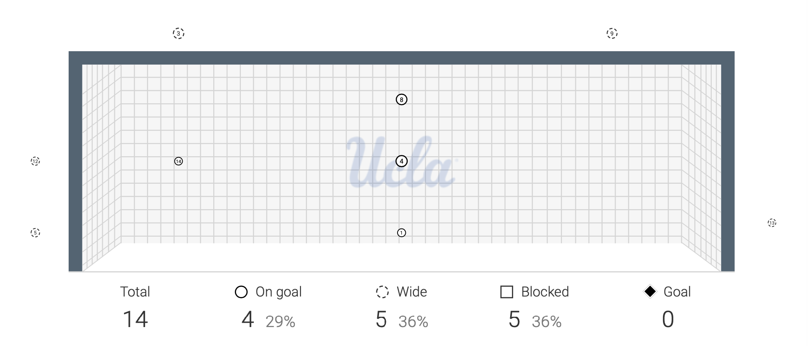
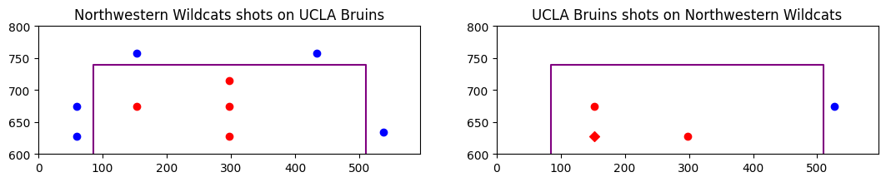
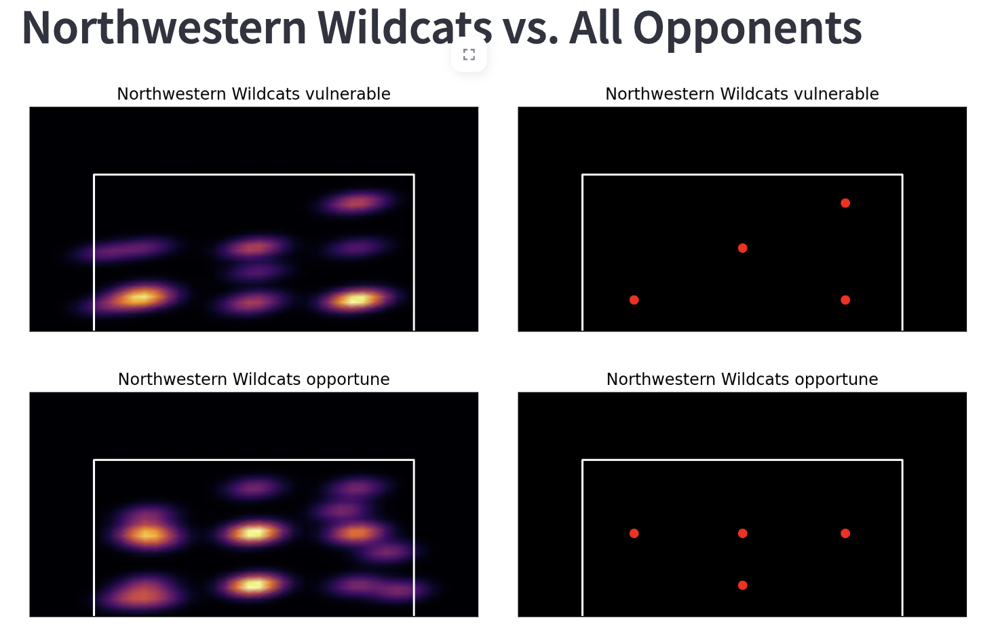

# Goal Guru

#### Heatmaps and DBSCAN on Big Ten Shot Data

#### Group Members :
- Ben Ledoux, Michael Bertagna, Paul McSlarrow
  
#### Build Instructions:
1. Clone the repo: <b>git clone https://github.com/bledoux2002/Hackathon_2024.git</b>
2. Download Docker Desktop and make sure it is *RUNNING*
3. Navigate to the root directory of the folder
4. In a terminal, run <b>./docker-build-run.bash</b>
   1. If this fails, try typing <b>chmod 755 *.bash</b> in the same directory
   2. On a Windows Machine, make sure either Git Bash or Windows Subsystem for Linux are installed and the command is run from one of those terminals.
5. Once this completes, go to the localhost link it provides to you to play around with the application.

#### Want to use your own examples?

#### Description

After games, coaches at Northwestern receive a detailed report provided by WyScout about the statistics 
correlated to the game. One of these pages, in particular, contains an image representing a picture of the goal 
and the shots taken around the goal, alongside the class associated with it (see figure 1). 

  
  
(Figure 1)

While beneficial for a brief glance of how things went for the game, we thought it may be more beneficial to use the historical image data between teams in the Big Ten and their opponents aggregated together to more easily identify the weak and strong points between teams. 

To obtain the data, we had to create a way to extract information from each game summary PDF at the appropriate page corresponding to the where the shots on goal were located (located in extract_pdf.py). The process for this is tedious, as PDFs are represented as a series of objects in which you use logic to classify what each object is based on the object's properties. We have a bunch of "curves" and "rectangles" which correlate to certain objects within the PDF, and we have to determine which of those objects denote a shot as opposed to legends or images, etc... If you look back at figure 1, you notice that we need a way to differentiate between the netting in the background, the goal-post, and the team logo in the center. This is where using a package like pdfplumber was useful as we could not interpret all the data corresponding to x and y coordinates for each of the shots and associate classes too them with some extra engineering (see figure 2).

  
  
(Figure 2)

After extracting information from each individual PDF, we were able to represent this in a table format (see figure 3) where each row represents a single shot and has associated attributes like the x and y axis as well as the classification of whether it was a goal or not. This information is crucial to our analysis because it gives us leverage to how we can filter out our data to focus our attention on individual teams. 

  
  
(Figure 3)

Finally we were able to use Streamlit, a service built to make web development quick and easy. Inside Streamlit, we create a filter sidebar that a coach would be able to adjust the teams to analyze that week. For example, if the coach wanted to see where Northwestern's vulnerabilities were with respect to goals being scored on them in all games played, the heatmap and DBSCAN can help identify both the weak and strong areas where most goals are given up as well as where most goals are scored (see figure 4). This way the coaches are able to use this information to better inform players in preparation for upcoming games. If the coaching staff wanted to get even more specific, we allow them to enter the opposing team as well, such that they could analyze the shot data between two teams. 

  
  
(Figure 4)

Our final plot that we focused on last minute was the field plot from where players are shooting from on the field. 

  
  
(Figure 5)

